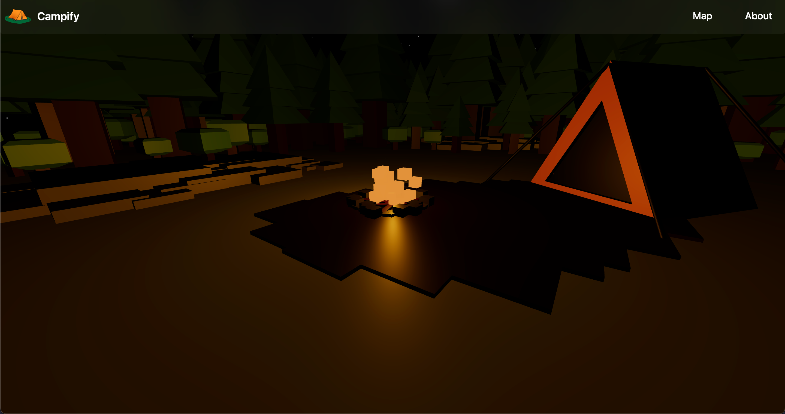

# Campify

[Campify](https://www.rentacamp.site/) is website for people to find outdoors experiences. It is an opportunity for
people who may not have enough experience to still have an enjoyable adventure with
an outdoors expert.

This is a project built during the 2023 Hack@Brown Event. Our group members are:
- Hammad Izhar, Project Manager
- Robert Scheidegger, Database
- Edward Bielawa, Animation
- Yizhong (Richard) Hu, Component Design

## Initiative

We realized that many people do want to enjoy camping experiences. However, what is 
preventing them is not interest, but fear of the dangers involved and/or social anxiety
associated with lack of experience. We aim to address this problem by setting up a website
that links the experienced outdoor specialists with possibly inexperienced people. 
We aim to craft a seamless experience such that people with no knowledge or gear can
still enjoy the outdoors.

## Features

We have the following features
1. Experiences Listing. Includes details of location, and experience description
2. Ability to search for experiences by Location, Start/End Date, Experience Type
3. Map to show the location of the experiences, which can also be used for searching
4. A beautiful low-poly interactive 3D animation on the main page of a campsite

## Campfire

The theme of the 2023 Hack@Brown event is Campfire. We address the theme in at least
two of the following ways:
1. We provide opportunities for camping, along with other activities
2. Our technology stack has the acronym CAMPFIRE:
   1. Chat GPT, Data generation
   2. Azure, Hosting
   3. MongoDB, Database / Material UI, Frontend Components
   4. Prisma, 
   5. Flowbite, Front-end Components
   6. Images from Bing
   7. React,
   8. Ed's Blender Models, Animation

